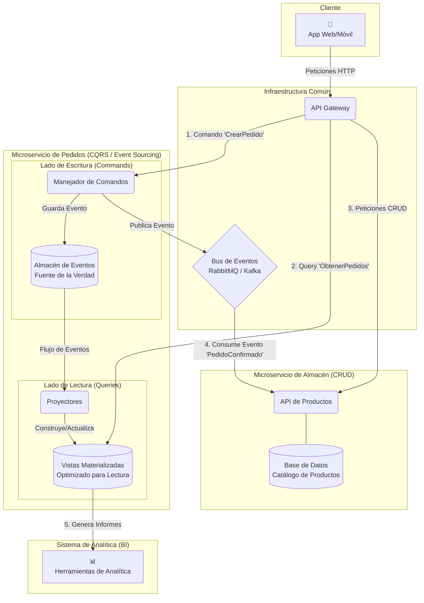

# Sistema de Gestión para E-commerce

Este repositorio contiene el backend para un sistema de gestión de una tienda online, diseñado bajo una arquitectura de microservicios. El proyecto incluye la implementación del microservicio de "Catálogo de Productos" y la propuesta arquitectónica para el sistema completo.

## 1. Visión General del Proyecto

Este proyecto busca construir un sistema interno robusto para una tienda online, enfocado en dos dominios de negocio principales: la **gestión del catálogo de productos** y la **administración del ciclo de vida de los pedidos**. El sistema está diseñado para proporcionar un control total sobre las operaciones de inventario (altas, bajas, modificaciones) y para registrar un historial auditable y detallado de cada pedido, desde su creación hasta la entrega.

Además, la arquitectura está preparada para soportar futuras herramientas de analítica y business intelligence, permitiendo a la empresa tomar decisiones estratégicas basadas en datos como los productos más vendidos, tiempos promedio de entrega o la actividad de los clientes.

## 2. Arquitectura del Sistema

La solución se basa en una arquitectura de microservicios orientada a eventos, diseñada para ser escalable, resiliente y mantenible a largo plazo.

### Enfoque Arquitectónico

Se propone una arquitectura de microservicios para aislar los dominios de negocio de Pedidos y Productos. Se aplica el patrón **Event Sourcing** en el servicio de Pedidos, utilizando el historial de eventos como fuente de la verdad para garantizar la trazabilidad completa. Para optimizar las consultas y potenciar la analítica, se implementa **CQRS**, separando la escritura (eventos) de la lectura, la cual se sirve desde **Vistas Materializadas** pre-calculadas. La comunicación asíncrona vía un **Bus de Eventos** desacopla los servicios, mientras que un **API Gateway** centraliza el acceso.

### Diagrama de la Arquitectura



---

## 3. Microservicio de Catálogo de Productos (Implementación)

Esta sección detalla la implementación del primer componente del sistema: el microservicio de gestión del catálogo de productos.

### Descripción

Se ha implementado una API RESTful que ofrece operaciones CRUD (Crear, Leer, Actualizar, Borrar) para los productos del inventario. La API está construida con Python y FastAPI, lo que proporciona documentación interactiva automática (Swagger/OpenAPI). Todo el entorno está containerizado usando Docker y Docker Compose, incluyendo la base de datos PostgreSQL y un gateway Nginx como proxy inverso.

### Estructura de Archivos del Proyecto

Para levantar el entorno localmente, la siguiente estructura de archivos es necesaria en el directorio raíz:
- `api.py`: El código fuente de la API de productos.
- `requirements.txt`: Las dependencias de Python.
- `Dockerfile`: Las instrucciones para construir la imagen de la API.
- `docker-compose.yml`: El orquestador para todos los servicios.
- `nginx.conf`: La configuración del gateway.
- `api.env`: Variables de entorno para la API.
- `db.env`: Variables de entorno para la base de datos.

### Cómo Empezar

1.  **Requisitos Previos:** Tener Docker y Docker Compose instalados.
2.  **Configuración:** Clonar este repositorio o colocar todos los archivos en un mismo directorio.
3.  **Lanzamiento:** Abrir una terminal en el directorio del proyecto y ejecutar el siguiente comando para construir las imágenes y levantar los contenedores:
    ```bash
    docker-compose up --build
    ```
4.  **Acceso:** Una vez levantado, el sistema será accesible a través del gateway en `http://localhost:1234`.

### Endpoints de la API

| Método     | URL                                    | Descripción                                         |
| :-----     | :------------------------------------- | :-------------------------------------------------- |
| `GET`      | `/almacen`                             | Redirige a la documentación interactiva.            |
| `GET`      | `/almacen/docs`                        | Muestra la documentación interactiva (Swagger UI).  |
| `GET`      | `/almacen/redoc`                       | Muestra la documentación de lectura (ReDoc).        |
| `GET`      | `/almacen/productos`                   | Obtiene la lista de todos los productos.            |
| `POST`     | `/almacen/productos`                   | Crea un nuevo producto.                             |
| `GET`      | `/almacen/productos/{producto_id}`     | Obtiene un producto específico por su ID.           |
| `PUT`      | `/almacen/productos/{producto_id}`     | Actualiza un producto existente por su ID.          |
| `DELETE`   | `/almacen/productos/{producto_id}`     | Elimina un producto por su ID.                      |
